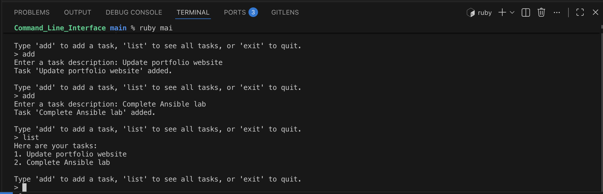

# Task Manager CLI (Ruby)

A command-line task management application built in Ruby that allows users to create and organize tasks through an interactive terminal interface.

This project was developed to strengthen my understanding of object-oriented programming, user input handling, loops, conditional logic, and modular application design.

---

## Demo



---

## Features

* Add new tasks
* View existing tasks
* Interactive command-line interface
* User-friendly menu system
* Input validation for supported commands
* Object-oriented design using a dedicated Task Manager class

---

## Technologies Used

* Ruby
* Object-Oriented Programming (OOP)
* Command Line Interface (CLI)

---

## Concepts Demonstrated

### Object-Oriented Programming

The application uses a dedicated `TaskManager` class to organize application functionality and maintain task data.

### User Input Handling

The program accepts user commands and responds appropriately using conditional logic and control flow.

### Loops

A continuous menu system allows users to interact with the application until they choose to exit.

### Modular Design

The project separates functionality into multiple files using:

```ruby
require_relative 'lib/task_manager'
```

This improves maintainability and code organization.

---

## Example Usage

```text
Welcome to the Task Manager CLI!

Type 'add' to add a task, 'list' to see all tasks, or 'exit' to quit.

> add

Enter a task description: Update portfolio website

Task 'Update portfolio website' added.

> add

Enter a task description: Complete Ansible lab

Task 'Complete Ansible lab' added.

> list

Here are your tasks:

1. Update portfolio website
2. Complete Ansible lab

> exit

Goodbye!
```

---

## How to Run

### Verify Ruby Installation

```bash
ruby -v
```

### Run the Application

```bash
ruby main.rb
```

---

## Future Improvements

* Delete tasks
* Mark tasks as completed
* Save tasks to a file
* Add due dates and priorities
* Search and filter tasks
* Persistent storage using JSON or SQLite

---

## Author

**Iris Daniels**

Computing Student | IT Professional

📧 [idaniel5@depaul.edu](mailto:idaniel5@depaul.edu)

🔗 LinkedIn: https://www.linkedin.com/in/iris-daniels-m

🌐 Portfolio: https://irisbuilds.tech

