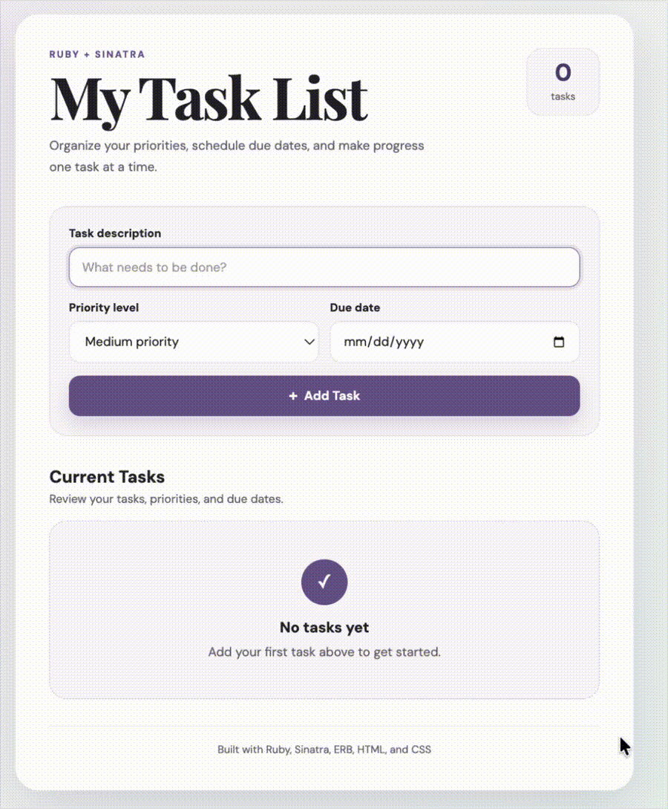

# ✅ TaskFlow – Ruby Task Manager

A modern task management application built with **Ruby**, **Sinatra**, **ERB**, **HTML**, and **CSS**. Originally developed as a command-line application, TaskFlow was expanded into a responsive web application featuring task organization, priority tracking, and due-date management.

---

## 🎥 Demo

<p align="center">
  
</p>

---

## ✨ Features

* 📝 Add new tasks
* 🚦 Assign Low, Medium, or High priority
* 📅 Set due dates using a calendar picker
* ✅ Mark tasks as completed
* 🗑 Delete tasks
* 📊 Live task counter
* 📱 Responsive layout for desktop and mobile
* 🎨 Modern pastel-inspired user interface
* 💎 Clean dashboard-style design

---

## 🛠 Technologies Used

* Ruby
* Sinatra
* ERB Templates
* HTML5
* CSS3
* Git
* GitHub

---

## 📁 Project Structure

```text
Command_Line_Interface/
├── app.rb
├── Gemfile
├── Gemfile.lock
├── lib/
│   └── task_manager.rb
├── public/
│   ├── styles.css
│   └── script.js
├── views/
│   └── index.erb
├── images/
│   ├── task-manager-demo.gif
│   └── screenshots...
├── README.md
└── main.rb
```

---

## 🚀 Getting Started

### Clone the repository

```bash
git clone https://github.com/Iris-daniels25/Command_Line_Interface.git
```

### Navigate into the project

```bash
cd Command_Line_Interface
```

### Install dependencies

```bash
bundle install
```

### Start the application

```bash
ruby app.rb
```

Open your browser and visit:

```text
http://localhost:4567
```

---

## 💻 Command-Line Version

This repository also includes the original Ruby command-line interface.

Run it with:

```bash
ruby main.rb
```

The CLI version demonstrates the original object-oriented implementation before the project was expanded into a web application.

---

## 🎯 Future Improvements

* 💾 SQLite database persistence
* ✏️ Edit existing tasks
* 🏷 Task categories
* 🔍 Search and filtering
* 📅 Monthly calendar view
* 🌙 Dark mode
* 📈 Progress dashboard
* 🔔 Due date reminders
* ☁️ Cloud deployment

---

## 📸 Screenshots

Add screenshots of:

* Dashboard
* Adding a task
* Priority levels
* Completed task
* Mobile layout

Example:

```md


```

---

## 👩‍💻 Author

**Iris Daniels**

* Portfolio: https://irisbuilds.tech
* GitHub: https://github.com/Iris-daniels25
* LinkedIn: https://www.linkedin.com/in/iris-daniels-m/

---

## 📄 License

This project is licensed under the MIT License.
